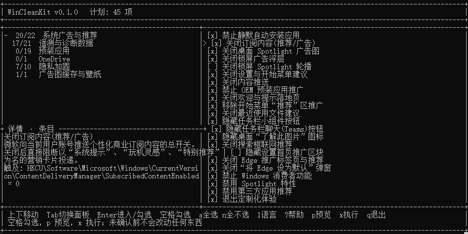
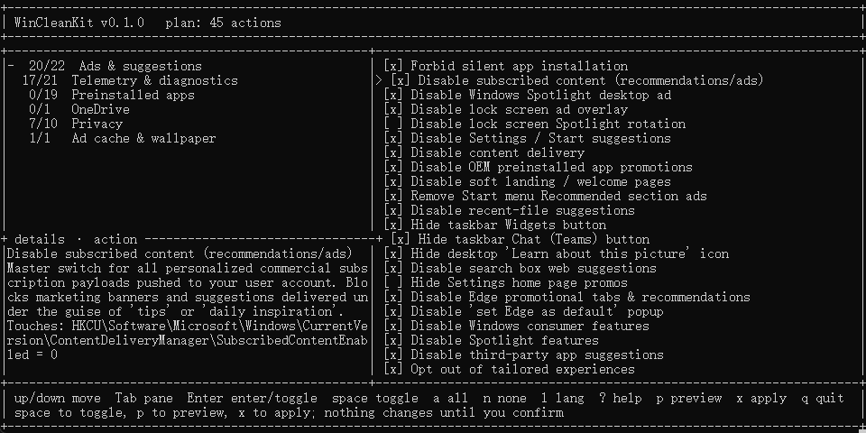

# WinCleanKit

**把 Windows 11 的广告、遥测和预装应用关掉 —— 改什么由你勾。**

[](https://github.com/ChanceFlow/WinCleanKit/releases/latest)
[](https://github.com/ChanceFlow/WinCleanKit/releases)
[](https://github.com/ChanceFlow/WinCleanKit/actions/workflows/ci.yml)
[](docs/CATALOG.md)
[](LICENSE)
[](#%E4%B8%8B%E8%BD%BD%E5%B9%B6%E8%BF%90%E8%A1%8C)

[English](README.md) · **中文说明**  
**文档:** [用法](docs/USAGE.zh-CN.md) ([EN](docs/USAGE.md)) · [安全](docs/SAFETY.zh-CN.md) ([EN](docs/SAFETY.md)) · [限制](docs/LIMITATIONS.zh-CN.md) ([EN](docs/LIMITATIONS.md)) · [行动目录](docs/CATALOG.md) ([中文](docs/CATALOG.zh-CN.md)) · [代码规范](docs/LINTING.md)  
**项目:** [参与贡献](CONTRIBUTING.zh-CN.md) ([EN](CONTRIBUTING.md)) · [安全政策](SECURITY.zh-CN.md) ([EN](SECURITY.md)) · [行为准则](CODE_OF_CONDUCT.zh-CN.md) ([EN](CODE_OF_CONDUCT.md)) · [更新日志](CHANGELOG.md) · [许可证](LICENSE)



开始菜单里的广告、「为你推荐」里从没装过的应用、锁屏上那张其实在推销的图片、关不掉的
小组件资讯流、搜出来全是必应和 MSN 的搜索框 —— Windows 11 默认就把这些全开着，而关掉它们
的开关散落在十几个设置页和注册表项里。

WinCleanKit 帮你一次关掉，**但只关你勾了的那部分**：每一条改动先用大白话告诉你它做什么，
你没点确认之前什么都不动，动手之前先在你桌面写好还原点。它就是一个文件夹加一个 `run.bat`：
不用安装、不用账号、不留后台服务、自己不收集任何数据。

- **你说了算。** 45 条最安全的默认勾好，剩下 29 条一个空格就能选上。你没选的不会执行，关掉的也不会被偷偷加回来。
- **先看见再动手。** 74 条操作，每条都写明改什么、为什么、触及哪些注册表或服务，然后再由你决定。
- **永远退得回去。** 每次执行都先把备份和一键还原脚本写到你的桌面。
- **它很克制。** 不动 `hosts`、不换壁纸、不碰你的文件、不关 Windows 更新、不拆 Edge。
- **中英双语**，一个按键切换。

---

## 下载并运行

1. **[下载最新版本](https://github.com/ChanceFlow/WinCleanKit/releases/latest)**，把 `WinCleanKit-<版本>.zip` 解压到任意位置 —— 桌面就行。
2. 双击 **`run.bat`**。
3. 在 Windows 弹窗里点「是」。改机器级设置需要管理员权限。
4. 选择界面语言，看一遍清单，勾选你要的，按 **`x`** 执行。

在你确认计划之前，系统里不会写入任何东西。

> [!NOTE]
> **环境要求：** Windows 10 1809+ 或 Windows 11，自带 Windows PowerShell 5.1 或更高版本即可。
> 无需安装、没有依赖，用完也不留残留：不想要了直接删掉文件夹。

<details>
<summary><b>其他启动方式，以及怎么校验下载</b></summary>

**用纯文本菜单代替全屏界面** —— 适合老终端、屏幕阅读器，或者你就是喜欢菜单：

```bat
run.bat --simple
```

**跳过语言选择：** `run.bat --zh` 或 `run.bat --en`。

**从克隆的仓库运行**，或直接在命令行调用：

```powershell
.\src\WinCleanKit.ps1 -Plan                      # 预览默认集，不做任何修改
.\src\WinCleanKit.ps1 -Apply -NoPrompt -Only telemetry
```

**先校验再运行。** 每个 release 都在 zip 旁边提供 `.sha256` 文件：

```powershell
Get-FileHash .\WinCleanKit-0.1.0.zip -Algorithm SHA256
```

**Windows 可能弹警告。** 这些脚本没有做代码签名，所以 SmartScreen 有时会说「Windows 已保护你的电脑」——
它对任何从网上下载的未签名脚本都这么说。上面那行哈希就是用来确认你拿到的确实是我们发布的文件，
而它每一行代码你都能在 `src/` 里读到。

</details>

---

## 界面长什么样



整个界面纯键盘操作，所有按键都写在窗口最后一行 —— 按 `?` 看完整说明。左列是分类和各自
的勾选进度，右列是具体条目，左下角解释当前高亮项。不需要鼠标，也不需要先读说明书。

<details>
<summary><b>按键说明</b></summary>

| 按键 | 作用 |
|---|---|
| `↑` / `↓` | 在当前面板内移动 |
| `Tab` | 在分类和条目之间切换焦点 |
| `Enter` | 进入分类；在条目列表中勾选并下移 |
| `空格` | 勾选 / 取消当前条目 |
| `a` / `n` | 勾选 / 取消当前分类全部 |
| `A` / `N` | 勾选 / 取消全部 74 项 |
| `l` | 切换界面语言 |
| `p` | 预览计划，不做任何修改 |
| `x` | 执行计划（会再确认一次，并先写好还原点） |
| `?` | 帮助 |
| `q` / `Esc` | 退出 |

</details>

---

## 它能改什么

6 个分类、74 条操作，每一条都是 Windows 自己的设置项、服务或应用。中括号里的数字是打开时
默认勾选的数量。

| 分类 | 里面是什么 |
|---|---|
| **系统广告与推荐** [20/22] | 锁屏与桌面 Spotlight 广告、「为你推荐」里的应用与内容、搜索框里的必应/MSN 资讯流、「提示与技巧」弹窗、更新后的推广落地页、Edge 推广标签页和「设为默认」弹窗。 |
| **遥测与诊断数据** [17/21] | 诊断数据级别、`DiagTrack`、兼容性评估、客户体验改善计划、应用影响遥测、活动历史、广告 ID、反馈请求。 |
| **预装应用** [0/19] | Clipchamp、Dev Home、纸牌、Office Hub、Bing 资讯与天气、地图、手机连接、Xbox 覆盖层等等 —— 每条都可以卸，也可以留着。 |
| **OneDrive** [0/1] | 移除客户端并阻止它自己装回来。**你的文件绝对不会被动** —— 卸载应用不会删除文件。 |
| **隐私加固** [7/10] | 广告 ID、输入与手写个性化、定位、设置同步、定制化体验。 |
| **广告图缓存与壁纸** [1/1] | 删除已经下载到本机的 Spotlight 广告图。不会碰你正在用的壁纸。 |

**74 条全部连原因一起写在 [docs/CATALOG.md](docs/CATALOG.md)** —— 而且这份清单本身就是数据
（`catalog/catalog.json`），所以你在文档里读到的，就是工具真正会做的。

### 它不会做什么

- **默认不卸载任何软件。** 19 个预装应用一个都不勾，OneDrive 也不勾 —— 要卸得你自己说。
- **不动 `hosts` 文件。** 用那种方式屏蔽微软会连带弄坏应用商店和更新，在办公机器上还会打断 VPN 与单点登录。
- **不关 Windows 更新**、不卸载 Edge、不碰个人文件、不改壁纸、不靠近 OneDrive 数据目录。
- **不关闭传递优化服务**（它是更新加速器）。其中 P2P 上传分享是单独的、可选的一条。

---

## 安全吗

**所有改动都能还原，而且工具默认你就会想还原。** 动手之前，一轮运行会先在你的桌面生成一个
带时间戳的文件夹：

```text
桌面\WinCleanKit-<时间戳>\
├── backup.json                 全部原始值，逐字节记录
├── Restore-WinCleanKit.ps1     一键把上面所有东西放回去
└── run.log                     每条改动一行：已生效、已跳过、失败
```

运行 `Restore-WinCleanKit.ps1`，设置会精确还原，服务回到原启动类型，被停用的计划任务重新启用。
卸载掉的商店应用会列在日志里，需要你自己去商店装回来 —— 这部分没法自动还原，所以它默认不勾。

有一件事值得先说清楚：**Windows 仍然会发送「必需」级诊断数据**，任何版本、任何工具都拦不住，
那是平台写死的下限。工具能做的是下限之上的部分。这条以及其他边界都写在
[docs/LIMITATIONS.zh-CN.md](docs/LIMITATIONS.zh-CN.md)。

如果是**办公机器**，请先花两分钟看 [docs/SAFETY.zh-CN.md](docs/SAFETY.zh-CN.md)。

---

## 常见问题

<details>
<summary><b>需要一直装着吗？</b></summary>

不需要，因为压根没有安装过程。解压、运行、删掉文件夹。它不留任何东西：没有服务、没有计划任务、没有托盘图标。
</details>

<details>
<summary><b>怎么全部撤销？</b></summary>

打开桌面上最新的 `WinCleanKit-<时间戳>` 文件夹，运行 `Restore-WinCleanKit.ps1`。设置、服务、计划任务都会回到
原来的样子。只有你自己选择卸载的应用仍然是卸载状态 —— 那个需要去微软商店重装。
</details>

<details>
<summary><b>会不会把系统、更新或浏览器弄坏？</b></summary>

它改的都是文档化的设置项，不打补丁、不改二进制、不拦网络。Windows 更新不碰，Edge 不卸，`hosts` 一概不动。
在域内或 Intune 管理的机器上，某些策略可能会被管理员重新下发 —— 见 [docs/SAFETY.zh-CN.md](docs/SAFETY.zh-CN.md)。
</details>

<details>
<summary><b>需要管理员权限吗？</b></summary>

需要 —— 大部分设置位于注册表的机器级位置。启动器会自己请求提权，你点一次「是」即可。
</details>

<details>
<summary><b>它会往外发数据吗？</b></summary>

不会。它不发起任何网络请求，也没有任何统计。想验证很简单：断网跑一次，或者直接读 `src/` ——
总共约 80 KB 的可读 PowerShell。
</details>

<details>
<summary><b>我只想改其中一两条，行吗？</b></summary>

行。界面上把不要的取消勾选即可：`空格` 单条，`n` 整个分类，`N` 全部。脚本化则用 `-Only`、`-Skip`、
`-FromFile`，见 [docs/USAGE.zh-CN.md](docs/USAGE.zh-CN.md)。
</details>

<details>
<summary><b>为什么跑完 Windows 还是在上报？</b></summary>

因为「必需」级诊断数据是所有 Windows 版本（含专业版）的下限。任何声称能完全关掉的工具，要么是错的，
要么正在弄坏你的系统。我们能做的是把下限之上的一切拿掉 —— 详见
[docs/LIMITATIONS.zh-CN.md](docs/LIMITATIONS.zh-CN.md)。
</details>

<details>
<summary><b>下载的就是整个仓库吗？</b></summary>

不是，而且这是故意的。release 里的 zip 只包含工具本体、用户文档和许可证 —— 二十来个文件。
测试套件、生成器和 CI 配置只存在于仓库里，是给改这个工具的人用的，不是给用这个工具的人用的。
</details>

---

## 命令行

`.bat` 只是启动器；`src\WinCleanKit.ps1` 才是引擎，所有决定都能用参数传入，因此也可以无人值守。

```powershell
.\src\WinCleanKit.ps1 -ListCatalog                                # 以 JSON 输出全部内容
.\src\WinCleanKit.ps1 -Plan                                       # 预览默认集
.\src\WinCleanKit.ps1 -Plan -Only 'ads.cdm.silent-install,apps.maps' -Language zh
.\src\WinCleanKit.ps1 -Apply -NoPrompt -Only telemetry            # 只做遥测这一类，不提问
.\src\WinCleanKit.ps1 -Apply -NoPrompt -FromFile .\my-selection.txt
.\src\WinCleanKit.ps1 -Apply -NoPrompt -Skip 'apps.xbox,apps.outlook-new'
.\src\WinCleanKit.ps1 -ListRestores
.\src\WinCleanKit.ps1 -Restore WinCleanKit-20260913-004942
```

`-Only` 是权威列表：传入后默认集完全不参与，你要什么就执行什么。全部参数见
[docs/USAGE.zh-CN.md](docs/USAGE.zh-CN.md)。

---

## 参与贡献

报 bug、提新操作、帮忙翻译都欢迎。新增一条操作通常只是改一小段 `catalog/catalog.json` ——
[CONTRIBUTING.zh-CN.md](CONTRIBUTING.zh-CN.md) 里写了规则和「一句好的说明」长什么样。
涉及可能被利用的问题请先看 [SECURITY.zh-CN.md](SECURITY.zh-CN.md)；要吵架请先看
[CODE_OF_CONDUCT.zh-CN.md](CODE_OF_CONDUCT.zh-CN.md)。

<a id="开发者"></a>
<details>
<summary><b>给开发者与打包者</b></summary>

```text
WinCleanKit/
├── run.bat                      双击入口
├── src/
│   ├── WinCleanKit.bat          提权、菜单、确认
│   ├── WinCleanKit.ps1          引擎 + 终端设计系统
│   ├── lib/                     全屏界面：逻辑、渲染器、按键循环
│   └── menu/menu.ps1            菜单数据提供者
├── catalog/catalog.json         全部 74 条操作，以数据形式存在
├── docs/                        用法、安全、限制、生成的行动目录
├── release/                     打包下载的第一页
├── tests/                       九道门禁
└── tools/                       New-CatalogDoc.ps1、New-ReleasePackage.ps1
```

九道门禁在 CI 中每次推送都会跑，Windows 与 Linux 各一遍：

| 门禁 | 回答什么问题 |
|---|---|
| `tests/Test-Parse.ps1` | 是不是合法 PowerShell？文件编码对不对？ |
| `tests/Test-Analyzer.ps1` | 能不能过 PSScriptAnalyzer？ |
| `tests/Test-Docs.ps1` | 链接是否可达、双语文档是否成对、有没有混进内网地址？ |
| `tools/New-CatalogDoc.ps1 -Check` | 生成的行动目录是不是最新的？ |
| `tests/Test-Catalog.ps1` | 每条操作是否完整安全？默认集是不是我们声称的那些？ |
| `tests/Test-Engine.ps1` | 选择语义与 dry-run 是否名副其实？ |
| `tests/Test-Tui.ps1` | 界面逻辑是否正常？每个状态变化是否都会触发重绘？ |
| `tests/Test-TuiRender.ps1` | 边框几何与绘制契约是否完好？ |
| `tests/Test-Release.ps1` | 打包下载是否只含产品本体？ |

`tools/New-ReleasePackage.ps1` 按两份封闭清单生成 `dist/WinCleanKit-<版本>.zip`，
**清单都没匹配上的文件会直接让构建失败** —— 这样新增文件既不会悄悄发给用户，也不会悄悄漏发。
当前各项检查数量与逐条规则的理由见 [docs/LINTING.md](docs/LINTING.md)。

</details>

---

## 许可证

[MIT](LICENSE)。随便用、随便 fork、随便发布。不提供任何担保 —— 它会改系统设置，请看清你勾了什么。
